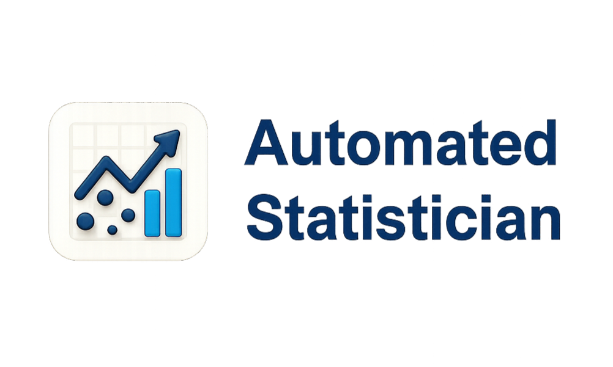

<p align='center'>
<strong><em style="font-size: 36px;">AutoSTAT v2: Statistical Analysis, Instantly.</em></strong>
</p>

<p align="center">
  
</p>

<p align="center">

AutoSTAT v2，致力于成为用户数据分析的 copilot。

一个入门友好、覆盖数据分析端到端流程、可通过与用户多轮交互持续优化效果，并具备承载未来 LLM 技术迭代能力的数据分析 Agent 框架，助你高效推进每一步分析任务。

</p>

---

## 功能特点

- **全流程覆盖，模块化重构数据分析。** AutoSTAT v2 覆盖导入、预处理、可视化、建模与报告生成五个流程。针对每一流程内任务采用模块化设计，专职 Agent 负责，将 Agent 的能力无缝融入数据分析。

- **编写代码，释放数据分析潜能。** Agent 不仅能精准理解用户需求，灵活调用现有工具，还可根据需求自主编写新工具。内置代码自愈机制（最多 5 轮自动修复），兼顾稳定性与灵活性。

- **自动模式，让 AI 主导数据分析。** 面向小白用户，简单上手。只需上传数据，剩下交给 Agent 负责。内置 Planning Agent 自动分解任务、智能分工，一键实现高质量数据分析报告。

- **专业报告，一键生成完整分析。** 多智能体协作自动生成初步目录，用户可灵活调整。Report Agent 基于最终目录，从概要到细节一键输出图文并茂的专业级数据分析报告，支持导出 Word / HTML / Markdown。

- **LLM 后端灵活，自由切换。** 支持任何 OpenAI 兼容 API（DeepSeek、OpenAI、通义千问、Moonshot、本地 Ollama 等），一行配置即可切换。

- **轻量级 RAG，无需向量库。** 基于 BM25 + 字段加权检索 274 条算法知识库，冷启动 < 100ms，无需额外部署向量数据库。

- **安全隔离执行。** 所有 LLM 生成的代码在独立子进程中运行，超时自动终止，不会影响主进程。

---

## 快速开始

> 请确保您的计算机上已安装 Python 3.10 及以上版本。
> 支持 Windows / macOS / Linux 环境。

### 1. 克隆项目

```bash
git clone https://github.com/Jiaye-s-Group/AutoSTAT-ver2.git
cd AutoSTAT-ver2
```

### 2. 环境配置

```bash
conda create --name autostat python=3.12
conda activate autostat
```

### 3. 安装依赖

```bash
pip install -r requirements.txt
```

### 4. 配置 LLM

```bash
cp .env.example .env
```

编辑 `.env` 文件，填入你的 API Key：

```ini
OPENAI_BASE_URL=https://api.deepseek.com/v1
OPENAI_API_KEY=sk-你的key
OPENAI_MODEL=deepseek-chat
```

支持的 LLM 服务：

| 服务 | BASE_URL | MODEL |
|---|---|---|
| DeepSeek | `https://api.deepseek.com/v1` | `deepseek-chat` |
| OpenAI | `https://api.openai.com/v1` | `gpt-4o-mini` |
| 通义千问 | `https://dashscope.aliyuncs.com/compatible-mode/v1` | `qwen-plus` |
| Moonshot | `https://api.moonshot.cn/v1` | `moonshot-v1-8k` |
| 本地 Ollama | `http://localhost:11434/v1` | `qwen2.5` |

### 5. 启动应用

```bash
streamlit run app.py
```

浏览器会自动打开 `http://localhost:8501`。

---

## 使用方式

### Web UI（推荐）

启动后进入 Streamlit 界面，按页面顺序操作：

1. **数据导入** — 上传 CSV → 点击"解析含义"
2. **数据预处理** — 获取建议 → 生成代码 → 自动执行
3. **数据可视化** — 推荐方案 → 批量生成交互图表
4. **建模分析** — 选择目标列 → 推荐模型 → 自动训练
5. **报告生成** — 生成目录 → 逐节填充 → 下载 Word / HTML / Markdown

也可以点击侧边栏的 **"开启自动模式"** 一键跑完所有页面。

### CLI 模式

```bash
# 单独运行某个阶段
python -m workflows.planning data/iris.csv "鸢尾花分类预测"
python -m workflows.loading data/iris.csv
python -m workflows.preprocessing data/iris.csv
python -m workflows.visualizing data/iris.csv
python -m workflows.modeling data/iris.csv species

# 一键运行完整流程
python -m workflows.autostat data/iris.csv species
```

### 作为 Python 库调用

```python
import pandas as pd
from workflows.autostat import run_autostat

df = pd.read_csv("data.csv")
result = run_autostat(
    df,
    user_input_model="我想做销量预测",
    target_column="sales",
    on_step=lambda step, _: print(f"完成 {step}"),
)
print(result["final_html"][:500])
```

---

## 系统架构

```
CSV 文件
  │
  ▼
Planning (分析路径规划)
  │
  ▼
Loading (数据语义解析) ──→ 数据概览
  │
  ▼
Preprocessing (智能预处理) ──→ 预处理后数据集
  │          ↻ 代码自愈循环 (最多5次)
  ▼
Visualizing (自动可视化) ──→ 交互图表集
  │          ↻ 代码自愈循环 (最多5次)
  ▼
Modeling (建模分析) ──→ 模型评估结果
  │          ↻ 代码自愈循环 (最多5次)
  ▼
Reporting (报告生成) ──→ Word / HTML / Markdown
```

---

## 项目结构

```
AutoSTAT_ver2/
├── app.py                 # 启动入口
├── .env.example           # 环境变量模板
├── requirements.txt
│
├── core/                  # 核心基础设施
│   ├── llm_client.py      #   OpenAI 兼容客户端（重试、JSON 鲁棒解析）
│   ├── prompt_template.py #   Prompt 模板渲染
│   ├── rag_retriever.py   #   BM25 算法知识库检索
│   └── workflow_runner.py #   辅助工具函数
│
├── workflows/             # 8 个 Workflow 实现
│   ├── autostat.py        #   总编排（串联所有子 workflow）
│   ├── planning.py        #   分析路径规划
│   ├── loading.py         #   数据语义解析
│   ├── preprocessing.py   #   预处理（含自愈循环 + RAG）
│   ├── visualizing.py     #   可视化（含批量并发生成）
│   ├── modeling.py        #   建模（含 RAG + 自愈循环）
│   ├── reporting_toc.py   #   报告目录生成
│   ├── reporting_partly.py #  报告逐节撰写
│   └── _plugins.py        #   辅助插件函数
│
├── prompts/               # LLM Prompt 模板（按阶段分目录）
├── knowledge/             # RAG 知识库（274 条算法）
├── frontend/              # Streamlit 前端界面
└── tests_offline*.py      # 离线测试脚本
```

---

## 常见问题

**Q: LLM 响应很慢？**
建议使用 `deepseek-chat` 或 `gpt-4o-mini` 等轻量模型，性价比较高。

**Q: 提示 `response_format is not supported`？**
系统会自动降级为从文本中解析 JSON，不影响使用。

**Q: 生成的代码一直执行失败？**
系统内置最多 5 次自动修复。如仍失败，可尝试更换更强的模型，或优化 `prompts/` 目录下对应的 prompt 模板。

**Q: 想替换算法知识库？**
替换 `knowledge/算法黄页.xlsx` 或编辑 `knowledge/algorithm_catalog.jsonl`，每行一条 JSON 记录。

**Q: Windows 下出现编码问题？**
```powershell
chcp 65001
$env:PYTHONIOENCODING="utf-8"
```

---

## 相关链接

API Key 获取：
- [DeepSeek](https://platform.deepseek.com/api_keys)
- [OpenAI](https://platform.openai.com/docs/overview)
- [通义千问](https://bailian.console.aliyun.com/)
- [Moonshot](https://platform.moonshot.cn/)

---

## 许可

本项目基于 MIT 许可证开源，详见 [LICENSE](./LICENSE) 文件。
